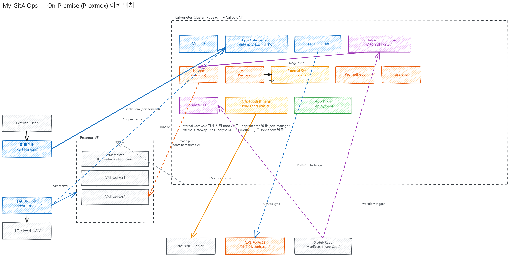
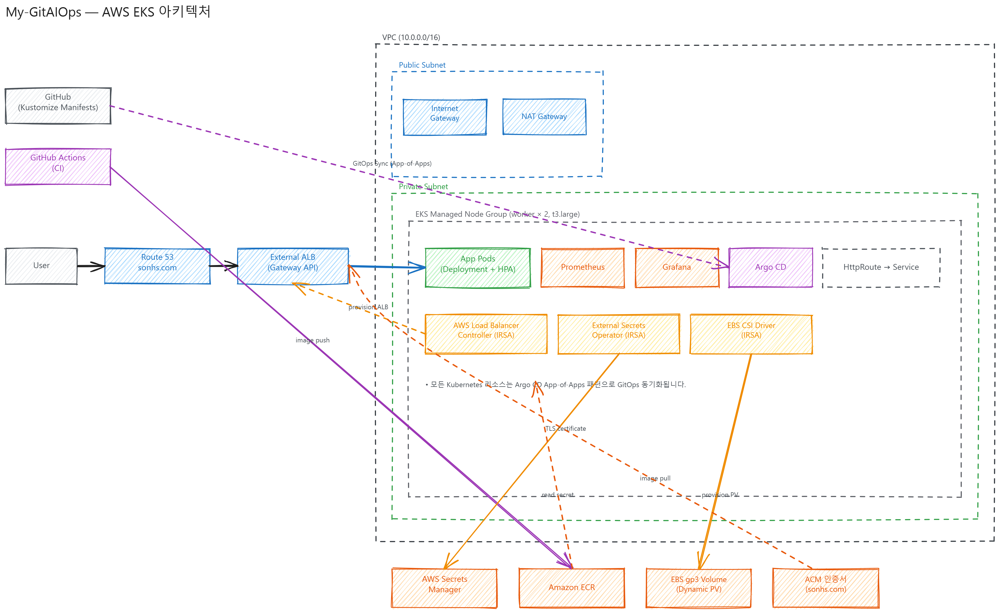
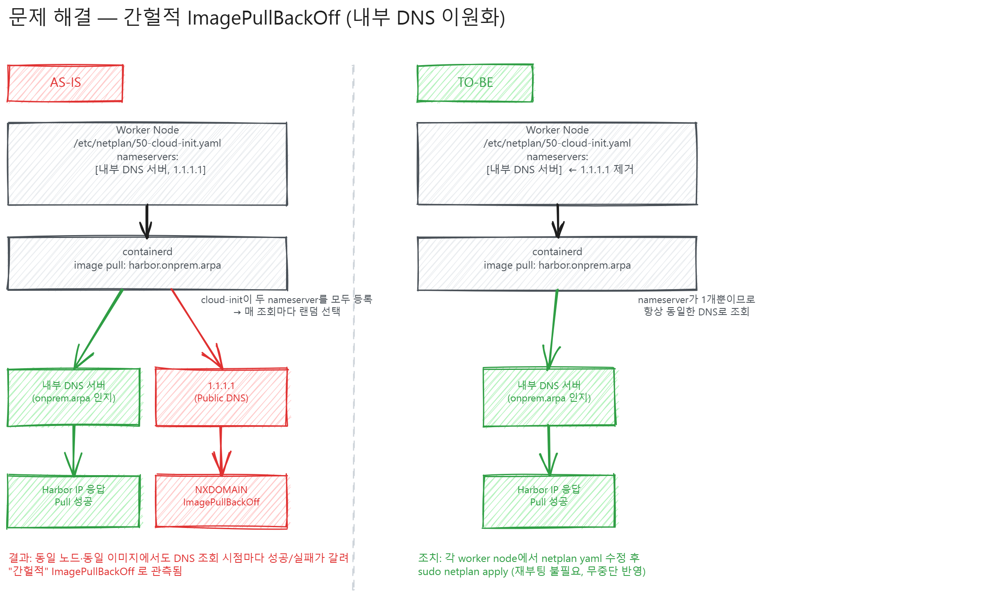

# My-IaC-GitOps

## 프로젝트 배경

오래전부터 홈랩에서 쿠버네티스 클러스터를 운영하며 블로그와 여러 개인/팀 프로젝트를 클러스터에 배포해왔습니다. 그런데 기기가 고장 나거나, 하드웨어를 업그레이드하거나, 클러스터 구성을 바꾸고 싶을 때마다 처음부터 다시 세팅해야 하는 것에 불편함을 느꼈고, 나의 클러스터와 프로젝트를 어느 환경에서나 일관성 있게 재현하고 싶다는 니즈가 생겼습니다.

이에 홈랩(Proxmox)의 인프라 환경을 수분~수시간 안에 재현할 수 있는 IaC 프로젝트를 기획하게 되었습니다. 추가적으로, 하는 김에 AWS에도 동일한 플랫폼을 구현하는 것이 실력 향상과 경험 측면에서 도움이 될 것이라 생각하여 AWS EKS 환경도 함께 구축했습니다.

인프라 프로비저닝, 클러스터 부트스트랩, 플랫폼 GitOps, 앱별 리소스를 4단계로 분리하여, 새 프로젝트를 배포할 때는 `04-apps`에 Harbor/ECR repository와 Secret 설정만 추가하면 바로 CI/CD와 GitOps 배포 파이프라인을 태울 수 있는 것을 목표로 했습니다. 온프레미스 kubeadm 클러스터와 AWS EKS를 동일한 GitOps 패턴(Argo CD App-of-Apps)으로 동시에 운영하고 있습니다.

Github: https://github.com/Son-Hunseo/My-IaC-GitOps

## 담당 역할

1인 프로젝트로 설계부터 IaC/Ansible/GitOps 작성, 운영, 트러블슈팅까지 전체를 담당했습니다.

### 인프라 계층 설계 (`01-infra` ~ `04-apps`)

- `01-infra`: Terraform으로 온프레미스 Proxmox VM(kubeadm 노드)과 AWS EKS(VPC/Subnet/NAT/EKS/NodeGroup/IRSA) 프로비저닝
- `02-bootstrap`: Ansible로 클러스터 초기화 및 Argo CD 설치 (온프레미스는 kubeadm, containerd, Calico 설치까지 포함)
- `03-k8s-clusters`: Argo CD App-of-Apps 패턴으로 플랫폼 컴포넌트(Gateway, 모니터링, 시크릿 관리, 레지스트리 등) GitOps 배포
- `04-apps`: 앱별 Harbor/ECR repository, GitHub Actions 인증, Vault/Secrets Manager 시크릿을 Terraform으로 프로비저닝

### 플랫폼 구성

- On-Premise: MetalLB, Nginx Gateway Fabric, Harbor(사설 레지스트리), Vault, cert-manager, ARC(GitHub Actions self-hosted runner), NFS Subdir External Provisioner, Prometheus/Grafana
- AWS: Gateway API(Nginx Gateway Fabric) + ALB, External Secrets Operator + Secrets Manager, EBS CSI Driver, Prometheus/Grafana

### 트러블슈팅

- 온프레미스 워커 노드에서 간헐적으로 발생하는 ImagePullBackOff 원인 분석 및 해결 (아래 트러블슈팅 참고)

## 아키텍처

### On-Premise (Proxmox)

- Proxmox VE 위에 master 1대 / worker 2대 VM을 생성하고, kubeadm + Calico CNI로 클러스터 구성
- MetalLB가 LoadBalancer IP를 할당하고 Nginx Gateway Fabric이 내부(`*.onprem.arpa`)와 외부(`sonhs.com`) Gateway를 함께 서빙
- 내부 인증서는 cert-manager 자체 서명 Root CA, 외부 인증서는 Let's Encrypt DNS-01(Route 53)로 발급
- 시크릿(Route53 자격증명, Harbor 관리자 계정, GitHub PAT)은 Vault + External Secrets Operator로 주입하며 Git 저장소에는 값이 존재하지 않음
- GitHub Actions self-hosted runner(ARC)가 클러스터 내부에서 직접 실행되어 Harbor로 이미지를 push하고, worker node containerd는 내부 Root CA를 신뢰하도록 구성되어 있음
- NAS(NFS)를 NFS Subdir External Provisioner로 연결해 Prometheus/Grafana/Vault/Harbor의 PVC를 제공

### AWS EKS

- VPC를 Public/Private Subnet으로 분리하고, EKS Managed Node Group은 Private Subnet에 배치
- 외부 진입점은 Gateway API 기반 External ALB(Nginx Gateway Fabric)이며, AWS Load Balancer Controller가 IRSA로 ALB를 프로비저닝
- External Secrets Operator(IRSA)가 AWS Secrets Manager의 값을 Kubernetes Secret으로 동기화
- EBS CSI Driver(IRSA)가 Prometheus/Grafana PVC를 gp3 동적 볼륨으로 프로비저닝
- 모든 플랫폼 컴포넌트와 애플리케이션은 Argo CD App-of-Apps 패턴으로 GitOps 동기화

## 고민한 점1 - On-prem/AWS 이중 환경을 위한 4계층 IaC 구조 설계

### 문제점

- 프로젝트마다 인프라를 처음부터 구성하면 반복 작업이 많고 설정 누락 위험이 큼
- 인프라 프로비저닝(Terraform), 클러스터 초기화(Ansible), 플랫폼 배포(GitOps), 앱별 리소스가 한 곳에 뒤섞여 있으면 특정 계층만 재실행하거나 삭제하기 어려움
- 온프레미스와 AWS는 프로비저닝 방식이 완전히 다르지만(Proxmox VM + kubeadm vs 관리형 EKS), 그 위의 플랫폼 구성은 최대한 동일한 패턴을 유지하고 싶었음

### TO-BE

- `01-infra`(Terraform) → `02-bootstrap`(Ansible) → `03-k8s-clusters`(Argo CD GitOps) → `04-apps`(앱별 리소스) 순서로 실행 단위를 분리
- 각 계층은 온프레미스/`onprem`, AWS/`aws` 디렉터리로 나뉘어 있지만, `03-k8s-clusters`부터는 두 환경 모두 Argo CD `AppProject` + root `Application` + child `Application`(App-of-Apps) 패턴을 동일하게 사용
- `03-k8s-clusters`는 `kubectl apply -f`로 전체를 한 번에 적용하지 않고, root `Application`만 적용해 하위 컴포넌트 동기화를 Argo CD에 위임

### 개선 효과

- 각 계층을 독립적으로 재실행/삭제할 수 있어 특정 단계(예: 인프라만 재구성)만 반복 가능
- 새 프로젝트를 배포할 때 `04-apps`에 Harbor/ECR repository와 Secret 설정만 추가하면 되므로 온보딩 비용이 낮음
- 온프레미스와 AWS가 같은 GitOps 패턴을 쓰기 때문에 플랫폼 컴포넌트(모니터링, 시크릿 관리 등) 구성을 그대로 참고해서 이식 가능

## 고민한 점2 - GitOps 시크릿 관리 (Vault / Secrets Manager + External Secrets Operator)

### 문제점

- Route53 자격증명, Harbor 관리자 계정, GitHub Actions PAT, 앱 런타임 시크릿 등 민감한 값을 GitOps 저장소에 직접 커밋할 수 없음
- 그렇다고 시크릿을 수동으로 `kubectl apply`하면 Argo CD가 추적하지 못하는 리소스가 생기고, 클러스터 재구성 시 복구 절차가 불명확해짐

### TO-BE

- On-Premise: Vault에 KV v2로 시크릿을 저장하고, External Secrets Operator가 Vault Kubernetes Auth로 인증 후 동기화
- AWS: Secrets Manager에 시크릿을 저장하고, External Secrets Operator(IRSA)가 이를 읽어 Kubernetes Secret으로 동기화
- cert-manager가 사용하는 Route53 DNS-01 자격증명도 직접 Secret으로 넣지 않고 Vault → ExternalSecret 경로로 주입
- Harbor 시스템 시크릿, GitHub Actions Runner 인증(PAT)도 동일하게 Vault 경로(`platform/harbor/system`, `platform/github-actions-runner`)로 관리

### 개선 효과

- 시크릿 값이 Git 저장소에 전혀 노출되지 않으며, GitOps로 추적되는 것은 "어떤 시크릿을 어디서 가져올지"에 대한 참조(ExternalSecret)뿐
- 시크릿 로테이션 시 Vault/Secrets Manager 값만 갱신하면 되고 GitOps 리소스 변경이 필요 없음
- 클러스터를 처음부터 재구성해도 Vault 초기화 → 시크릿 입력 절차만 거치면 나머지는 자동으로 회복됨

## 트러블슈팅 - 간헐적 ImagePullBackOff (내부 DNS 이원화)

### AS-IS / 문제점

온프레미스 worker node에서 이미지를 정상적으로 pull하다가도 간헐적으로 `ImagePullBackOff`가 발생했습니다.

원인을 추적해보니 cloud-init이 `/etc/netplan/50-cloud-init.yaml`의 `nameservers`에 의도치 않게 내부 DNS 서버와 함께 `1.1.1.1`(공인 DNS)까지 등록하고 있었습니다. containerd가 `harbor.onprem.arpa`를 조회할 때마다 두 nameserver 중 하나가 랜덤하게 선택되었고, `1.1.1.1`이 선택되면 내부 도메인을 알지 못해 `NXDOMAIN`이 발생해 이미지를 pull하지 못했습니다. 동일한 노드, 동일한 이미지에서도 DNS 조회 시점에 따라 성공/실패가 갈리다 보니 "간헐적"으로만 재현되어 원인 파악이 까다로웠습니다.

### TO-BE

각 worker node의 `/etc/netplan/50-cloud-init.yaml`에서 `1.1.1.1`을 제거하고 내부 DNS 서버만 nameserver로 남긴 뒤 `sudo netplan apply`를 실행했습니다.

### 개선 효과

- containerd가 항상 내부 DNS로만 조회하므로 `harbor.onprem.arpa` 해석이 매번 성공
- `netplan apply`는 재부팅 없이 즉시 반영되므로 무중단으로 조치 가능
- 이후 재발하지 않아 온프레미스 클러스터의 이미지 pull 안정성 확보

## 사용 기술

Terraform / Ansible / Kubernetes(kubeadm, EKS) / Argo CD (App-of-Apps) / Calico / MetalLB / Nginx Gateway Fabric(Gateway API) / Harbor / Vault / External Secrets Operator / cert-manager / Prometheus / Grafana / GitHub Actions (ARC self-hosted runner) / AWS(EKS, VPC, IAM/IRSA, Secrets Manager, ECR, ACM, Route 53)
